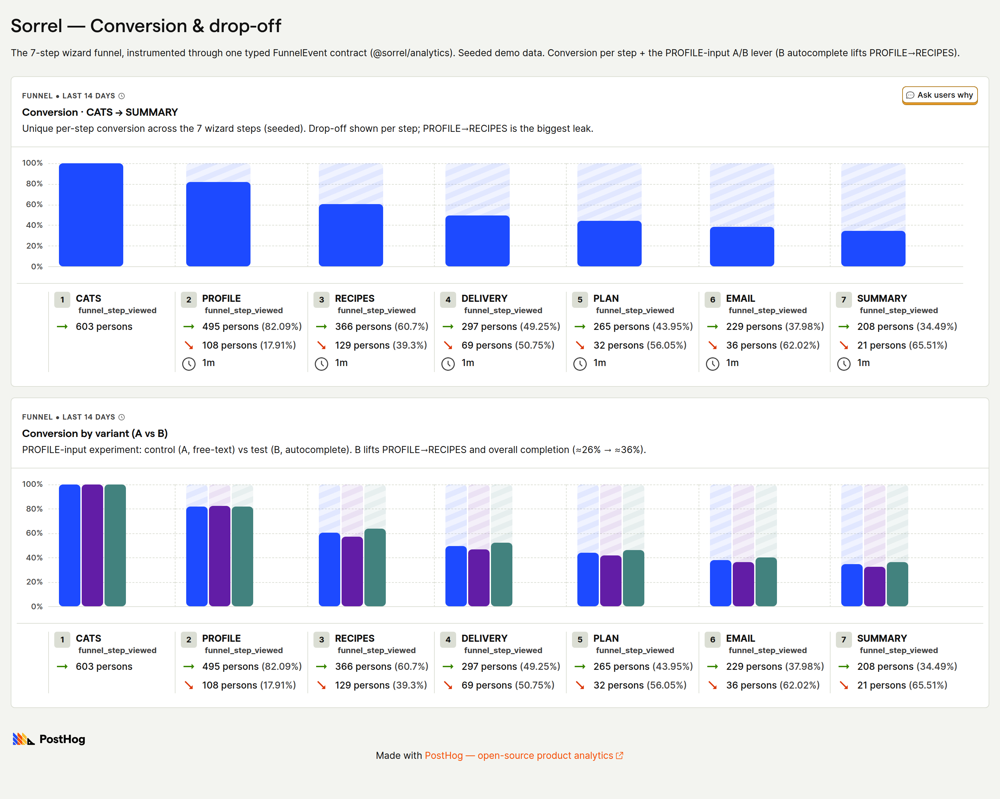

# 🐾 Sorrel — fresh, vet-formulated food for cats

A mobile-first subscription **onboarding funnel**, built as an engineering artifact for a
conversion-engineering role: instrument the funnel, find the leaking step, fix it, and
**prove the fix with live telemetry** — not a slide.

<p>
  <strong>▶ Live funnel — <a href="https://sorrel.akinoztorun.dev/">sorrel.akinoztorun.dev</a></strong>
  &nbsp;·&nbsp; 📈 Live insights — <a href="https://sorrel.akinoztorun.dev/insights">/insights</a>
  &nbsp;·&nbsp; 📒 Live Storybook — <a href="https://sorrel-ui.akinoztorun.dev/">sorrel-ui.akinoztorun.dev</a>
</p>

> _Sorrel is a fictional brand created for this demo. No real company, product, or brand
> assets are referenced anywhere in this repository._

---

## 60-second read

- **What it is** — a deployed, bilingual, CMS-driven 8-step signup wizard for a cat-food
  subscription, instrumented end to end.
- **The method** — conversion is treated as an engineering discipline: every step is a typed
  analytics unit, every UX choice names an expected effect and a way to verify it, and quality
  is enforced by hooks and CI budgets rather than by hope.
- **The proof** — the funnel and its A/B run **live in PostHog and Mixpanel** (links below),
  read back into an in-app `/insights` page, and reproducible from a seed script. The demo
  numbers are **synthetic and labelled as such** — the rigor, not the lift, is the point.
- **The headline fix** — the biggest leak is **PROFILE → RECIPES**; swapping that step's
  inline pills for smart-default dropdowns (a flag-gated A/B) narrows it.

---

## Proof: the funnel is measured, not asserted

[](https://eu.posthog.com/shared/AyCBlgIi0jXid5evzmr57aoMzqeI9w)

<sub>
**Live PostHog board** (click the image) — per-step conversion + the PROFILE-input A/B, built
from one typed <code>FunnelEvent</code> contract. <strong>Seeded demo data, ~600 sessions (300
per variant)</strong>; the board charts the seven CATS→SUMMARY legs (CHECKOUT is the Stripe
test-mode 8th step). PROFILE→RECIPES is the biggest single-step drop, and the variant view
shows B (smart-default dropdowns) recovering it. Reproducible with
<code>yarn workspace @sorrel/frontend seed:posthog</code>.
</sub>

| Where to look                                                                        | Link                                                                                        |
| ------------------------------------------------------------------------------------ | ------------------------------------------------------------------------------------------- |
| 📊 PostHog funnel + A/B (backend of record)                                          | **[eu.posthog.com/shared/…](https://eu.posthog.com/shared/AyCBlgIi0jXid5evzmr57aoMzqeI9w)** |
| 📊 Mixpanel funnel — _the same typed events, fanned to a second vendor_              | **[eu.mixpanel.com/p/…](https://eu.mixpanel.com/p/9nWo1kTCs62uUF4BEj8EZo)**                 |
| 📈 `/insights` — reads the live PostHog funnel in-app, with a labelled seed fallback | **[/insights](https://sorrel.akinoztorun.dev/insights)**                                    |

The Mixpanel board is the same funnel from the **same instrumentation** — one event contract,
fanned to a second destination through a vendor-agnostic sink, no changes at the emit sites.
That it lights up in two vendors at once is the proof the seam works.

---

## Thesis

**Conversion is an engineering discipline: instrument, find the step, fix the step, lock it
with budgets.**

The method here once took a real onboarding funnel from **39% → 65%** completion — prior work,
employer unnamed, and _not_ reproducible in this repo. Sorrel exists so the **method** is
inspectable even though that headline isn't: same discipline, applied to a fresh-cat-food
signup, every claim wired to telemetry you can click.

What the demo's own A/B actually shows is deliberately honest. Through the full CATS→CHECKOUT
funnel the seed reports **variant A ≈24.3% → B ≈27.0% (+2.7 pp)** — a real but modest gap,
because inline pills are already a credible control. The number is **reproducible**
(`yarn workspace @sorrel/frontend seed`), labelled synthetic, and never dressed up as
production traffic. Naming the small number is the point: the discipline is what transfers.

---

## Why this is conversion _engineering_

1. **A typo'd event is a compile error.** `FunnelEvent`
   (`packages/analytics/src/events.ts`) is a discriminated union; a wrong event name or a
   missing prop fails type-check, and an exhaustiveness test fails CI. The funnel contract is
   code, not a tracking-plan spreadsheet that drifts.
2. **A real A/B, threaded end to end.** One stable per-session bucket; the variant is captured
   on the PROFILE view **and** its completion, and carried through to checkout — so the split
   is attributable at every leg, not just at assignment.
3. **The loop is closed.** `/insights` reads the live PostHog funnel through the server-side
   Query API and falls back to committed seed JSON, **labelling its source** — so the page is
   honest whether or not a key is present. Instrument → measure → read back, in one repo.

---

## The funnel

A URL-segmented wizard (`/wizard/[step]`) — deep-linkable, correct back-button behaviour, each
step its own analytics unit.

| #   | Step             | What it does                                                                                                                          |
| --- | ---------------- | ------------------------------------------------------------------------------------------------------------------------------------- |
| 1   | **Cats**         | how many cats to feed                                                                                                                 |
| 2   | **Profile**      | name, age, weight — **the conversion lever** (see below)                                                                              |
| 3   | **Recipes**      | dietary-filtered cards, CMS-driven                                                                                                    |
| 4   | **Delivery**     | the [date-picker centrepiece](#the-delivery-date-picker)                                                                              |
| 5   | **Plan & price** | optimistic price preview (`useOptimistic`); authoritative price from `packages/domain`                                                |
| 6   | **Email**        | server action with server-side validation (`useActionState`)                                                                          |
| 7   | **Summary**      | review the assembled plan and confirm                                                                                                 |
| 8   | **Checkout**     | Stripe **test-mode** PaymentElement; the server re-derives the price and creates the PaymentIntent — the client never sends an amount |

**The lever (PROFILE).** PROFILE→RECIPES is the funnel's biggest single-step drop, so it's
where the A/B lives: variant **A** shows every option as inline pills; variant **B** uses
pre-filled `select` dropdowns with smart defaults — split behind a PostHog flag. Pre-filling
removes a decision, which is what narrows the leak.

**Abandonment is recoverable, two-tier:** local-draft resume on reload, plus a
`saveFunnelDraft` server autosave through the Apollo write-path. Exit-intent is instrumented
as a measurable ratio (`exit_intent_recovered ÷ exit_intent_shown`).

---

## Conversion instrumentation

The whole contract, instrumented once and fanned to every destination:

```
funnel_step_viewed   step_completed   field_error (machine codes)   funnel_abandoned
exit_intent_shown    exit_intent_recovered
payment_intent_created   payment_succeeded   payment_failed
```

- **One typed contract, one sink seam.** A thin `AnalyticsSink`
  ([`wizard/analytics.ts`](apps/web/app/%5Blocale%5D/wizard/analytics.ts)) fans each event to
  destinations that never touch the emit sites. **PostHog is the backend of record** — it owns
  product analytics, the `profile-input` flag the wizard reads, and the experiment. **Mixpanel**
  rides the same seam as an opt-in second destination (one env key, zero instrumentation
  changes); production runs single-vendor by default.
- **Fail-open A/B timing.** The first step's view is held up to 750 ms for the PostHog flag to
  settle, then fires anyway — so no session lands in an unattributed `variant: undefined`
  cohort.
- **`/insights` reads live PostHog**, with a deterministic seed fallback, and labels which one
  it rendered. Keyless builds stay green and never imply live traffic. (Key/scope detail lives
  in the [env table](#environment-variables) — it's a server-only `query:read` key, never a
  `NEXT_PUBLIC_*`.)

**The demo numbers are seeded, and say so.** Both backends are populated from the typed
contract (`seed:posthog` / `seed:mixpanel`), replaying the same funnel at 300 sessions per
variant; the in-app `/insights` fallback JSON uses 1,000 per variant. These are synthetic
sessions for a reproducible demo — the live read layers any organic traffic on top and labels
it as such.

---

## Architecture

A yarn-workspaces monorepo:

```
apps/web            Next.js 16 App Router, React 19, strict TS; MUI via the App* layer
services/api        Apollo Server: recipes, pricing, plans, mutations (schema-mocked)
packages/ui         Delivery date picker + the App* component layer, two brand themes
packages/domain     Pricing rules, portion calc, plan invariants — unit tested
packages/analytics  Typed funnel-event contract, shared by web and seed scripts
packages/shared     Cross-cut types (the funnel-step tuple), schema-synced by a test
```

> **Contracts are the anti-invention mechanism.** `schema.graphql` (GraphQL codegen,
> per-consumer) and `packages/domain` are the single sources of truth — so an invented field,
> prop shape, or endpoint becomes a compile error before any human reads the diff. The domain
> math lives **only** in `packages/domain`; a guard hook (`guard-domain-logic.sh`) enforces it,
> after `computePlan` once drifted into the API.

**MUI behind an intent layer.** `apps/web` carries **no `sx` props and no direct `@mui`
imports** — UI intent goes through the `App*` layer in `packages/ui/src/app` (`AppButton`,
`AppField`, `AppToggleGroup`, …), whose typed props omit `sx` entirely. One token source, two
skins, swappable at the prop boundary.

---

## Spec-gated quality enforcement

> _I do not prevent the model from being wrong, I make wrong un-mergeable._

This repo is also an exhibit of an agentic engineering workflow where the enforcement lives in
the repository, not in a process doc. The chain:

1. **A human writes the spec** under [`specs/`](specs/) and sets `approved: yes`. The agent
   implements only approved specs — anything else stops for approval.
2. **The agent implements** → a `Stop` hook runs type-check + domain tests and **fails the turn
   if red** ([`.claude/hooks/`](.claude/hooks/)).
3. **Touching a source-of-truth file** (`schema.graphql`, `packages/domain`) → a `PreToolUse`
   guard pauses for human review.
4. **Every commit** must carry a `Spec: NNN` trailer.
5. **Every PR** → CI re-checks that each commit's `Spec: NNN` resolves to an `approved: yes`
   spec, or the merge is blocked.

Rules live as contracts in [`.claude/rules/`](.claude/rules/); single-lens review agents
(contract, conversion, accessibility, architecture, QA) live in
[`.claude/agents/`](.claude/agents/). The git log _is_ the demo: spec → approval →
implementation → green checks → merge.

---

## Quality & verification

Verification is deterministic and runs in CI on every PR.

- **159 unit tests** across the workspaces (domain 53 · ui 43 · api 21 · web 31 · analytics 6 ·
  shared 5) — they assert behaviour and invariants, not just render: the pricing/portion maths,
  the calendar's month/year/leap/DST edges, `jest-axe` on the picker, and schema-sync guards
  that read `schema.graphql` directly and fail CI if an enum diverges from its app-side mirror.
- **A 22-case Cypress catalog** across 5 specs: a CATS→CHECKOUT happy path (with the `4242` test
  card) asserting the typed funnel events fired end-to-end and the variant payload threaded
  through, plus a delivery-picker correctness / UX / `cypress-axe` real-browser catalog.
  Deterministic via three dev-only hooks (clock + SSR-`today` cookie + pinned A/B bucket).
- **CI gates** ([`.github/workflows/`](.github/workflows/)): type-check, lint, format,
  codegen-sync, the per-workspace unit matrix, a production build, the Cypress suite, a
  **spec-trailer gate**, and a Lighthouse mobile budget.
- **Lighthouse** (mobile, median of 3 — [`docs/lighthouse.md`](docs/lighthouse.md)): landing
  **93 / 95 / 100 / 92**, `/wizard/cats` **90 / 95 / 100 / 92** (perf / a11y / best-practices /
  SEO); accessibility and best-practices are hard error budgets in CI.

**Honest limitations.**

- The `apps/web` step forms are covered end-to-end by Cypress rather than by per-component RTL
  tests (which live in `packages/ui`).
- The Cypress happy path pins **variant A**; variant B is unit-tested but not driven e2e.
- The RECIPES step's CMS fetch blocks server-side (no streaming `loading.tsx` shell yet).

---

## The delivery date picker

The Tier-1 centrepiece (`packages/ui`) and the design-system proof — **one logic shell, two
brand themes**. The same picker renders the **Sorrel** and **Bramble** skins from a single
token swap; structure, keyboard model, and ARIA are identical across both. Explorable in the
**[live Storybook](https://sorrel-ui.akinoztorun.dev/)**. Spec:
[`specs/001-delivery-date-picker.md`](specs/001-delivery-date-picker.md).

- Pre-selected earliest deliverable date; animated modal over a scrim, Monday-first grid;
  blocked weekdays shown not hidden (`aria-disabled` + reason).
- Screen-reader complete: focus trap, ESC, return-focus, `aria-modal`, roving-tabindex grid
  nav, `inert`-neutralised background, polite live region for the draft selection.
- Three-state exit animation (`open → closing → closed`) with a `prefers-reduced-motion`
  fallback and a safety-net timer, so the modal can never stick in `closing`.
- Date logic lives in `packages/domain` (an ESLint rule forbids inlining calendar math in the
  UI), unit-tested across month/year/leap/DST boundaries, and proven clean by `jest-axe` in
  both themes **and** real-browser `cypress-axe` — not green-by-suppression.

---

## Run it locally

```bash
nvm use                # Node 24 — see .nvmrc; yarn refuses on Node 18
yarn install
cp .env.example .env    # then fill the values — see the env table below
ln -s .env apps/web/.env # Next.js needs it in the app workspace for the env vars to be available at build time
yarn workspace @sorrel/frontend dev   # the funnel at http://localhost:3000/wizard/cats
yarn workspace @sorrel/api dev        # GraphQL mock at http://localhost:4000

yarn type-check        # strict TS across the workspaces (0 errors required)
yarn test              # the full unit matrix
yarn codegen:check     # fail the build if schema.graphql is invalid or codegen drifts
```

Storybook: `yarn workspace @sorrel/ui storybook` (or the deploy at
**[sorrel-ui.akinoztorun.dev](https://sorrel-ui.akinoztorun.dev/)**). Before any demo, walk the
19-item [`docs/pre-delivery-smoke.md`](docs/pre-delivery-smoke.md).

### Environment variables

`.env.example` is the canonical template. Build-time keys must also be set in the **Vercel
Production + Preview** environment because Next.js inlines `NEXT_PUBLIC_*` at `yarn build` time;
runtime keys only need to live in the Vercel dashboard.

| Class       | Key                                                                | Used by                                                                        |
| ----------- | ------------------------------------------------------------------ | ------------------------------------------------------------------------------ |
| Build-time  | `NEXT_PUBLIC_POSTHOG_KEY` / `_HOST`                                | Client PostHog SDK (ingestion)                                                 |
| Build-time  | `NEXT_PUBLIC_MIXPANEL_TOKEN` / `_HOST`                             | Optional second sink                                                           |
| Build-time  | `NEXT_PUBLIC_SITE_URL`                                             | RSC absolute-URL fallback — **Production scope only**                          |
| Build-time  | `NEXT_PUBLIC_STORYBLOK_PUBLIC_TOKEN`                               | Storyblok Visual Editor bridge                                                 |
| Build-time  | `NEXT_PUBLIC_STRIPE_PUBLISHABLE_KEY`                               | The only client-side Stripe surface                                            |
| Server-only | `POSTHOG_PERSONAL_API_KEY` / `POSTHOG_PROJECT_ID` / `POSTHOG_HOST` | `/insights` live funnel read (`query:read` scope — never `NEXT_PUBLIC_*`)      |
| Server-only | `STRIPE_SECRET_KEY` / `STRIPE_WEBHOOK_SECRET`                      | `/api/checkout/{intent,webhook}` (a Restricted `rk_test_…` key is recommended) |
| Server-only | `STORYBLOK_*` (preview / webhook / PAT / region)                   | CMS draft + revalidate paths                                                   |

**Vercel `NEXT_PUBLIC_SITE_URL` scoping.** Set it in **Production** only; leave it blank on
Preview, so the Apollo RSC client falls through to `VERCEL_URL` and preview RSC calls hit the
preview deploy's own `/api/graphql` rather than production's.

**Stripe test mode.** The CHECKOUT step uses the PaymentElement against **test mode only**; the
client posts only `{ draftId }` and the server re-derives the price via the GraphQL contract.
No account? `npm i -g @stripe/cli && stripe sandbox create` mints a test keyset. Test cards:
`4242 4242 4242 4242` (succeeds), `4000 0000 0000 9995` (declines). The Cypress workflow needs
`NEXT_PUBLIC_STRIPE_PUBLISHABLE_KEY`, `STRIPE_SECRET_KEY`, and `STRIPE_WEBHOOK_SECRET` as repo
secrets; the other CI jobs don't.

**Dev-only test hooks** (all no-ops in production): a `sorrel_e2e_today` cookie overrides the
picker's SSR `today`; `window.__sorrelVariant` pins the A/B bucket; `window.__sorrelAnalyticsQueue`
mirrors the in-memory sink so Cypress can assert the typed events fired.

---

## Status

All three delivery tiers are shipped — the 8-step wizard with typed instrumentation (Tier 1);
Storyblok-driven content, i18n (en/de) with hreflang, the full CI gate matrix, and the Cypress
happy path (Tier 2); and the `/insights` live-PostHog page, Storybook on the centrepiece, the
Stripe test-mode checkout, and real-browser `cypress-axe` (Tier 3). The build is governed by
~40 approved specs under [`specs/`](specs/).
